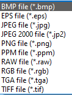
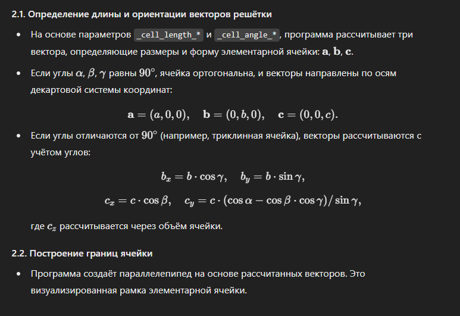
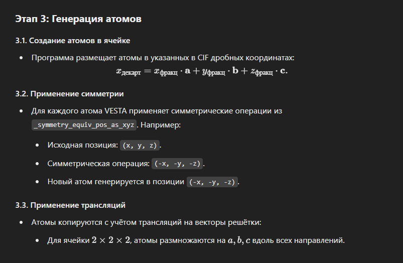
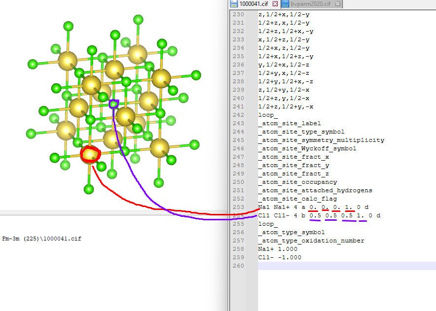
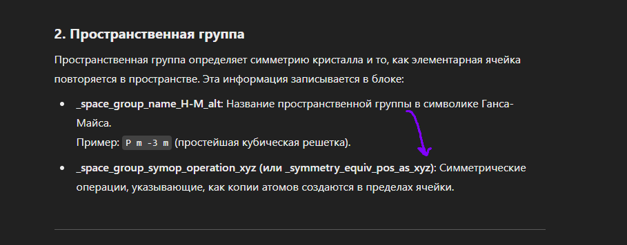

# Курсовая работа по дисциплине "Базы данных"

Распознание кристаллических решеток.

## Структура проекта

### Директории

* data - файлы для обработки и вывода (cif/json/xyz/images)
* db - скрипты базы данных
* src - файлы ресурсов для интерфейса
* ui - описания пользовательских интерфейсов на qt

### Скрипты

База данных:

* db_init.py - инициализация базы данных
* lattice_types_init.py - заполнение всех базовых типов кристаллических решеток

Приложение:

* main.py - запуск приложения с интерфейсом
* json_to_db.py - Добавляет информацию из json файла в базу данных. Заполняет таблицы substances и ions_library.
* xyz_to_db.py - Добавляет информацию из xyz файла в базу данных. Заполняет таблицу ions.

## Требования

* python 3.10+
* requirements.txt
* MySQL 8.0+ Server (localhost:3306) + `pip install mysql-connector-python` + root password

## Дополнительно

База lattice_type заполняется всеми стандартными типами кристаллических решеток.

## Cheatsheet

* Пересоздать базу данных

1. Пересоздадим бд

```bash
drop database crystal_lattice_db;
create database crystal_lattice_db;
use crystal_lattice_db;
```

2. `db_init.py`
3. `lattice_types_init.py`
4. Заполнить данными `json_to_db.py`, `xyz_to_db.py`

* Посмотреть таблички

```bash
use crystal_lattice_db;
show tables;
select * from lattice_type;
select * from substances;
select * from ions_library;
select * from ions;
```

* Установить язык

```python
cursor.execute("\\! chcp 1251")
```

* Ручной перевод cif -> json в ubuntu

```bash
cif_filter *.cif --json-output > *.json
```

* Ручной перевод всех cif файлов в директории в json

```bash
for file in *.cif; do cif_filter "$file" --json-output | jq '.' > "${file%.cif}.json"; done
```

## Задачи

### Текущие

- [x] ~~Сделать формат для сохранения json (не в одну строку)~~
- [x] ~~Скрипт cif->json~~
- [x] ~~Скрипт json->MySQL отдельный файл~~
- [x] ~~Нужно сделать так, чтобы скрипты из db можно было вызывать в других приложениях с указанием файла в параметрах/аргументах вызова. sys.argv?~~
- [x] ~~Чтение данных из БД и вывод в интерфейс.~~
- [ ] Подумать какие поля и как выводить в UI
- [ ] 1-10 + ... ионов в UI
- [x] ~~сделать вызов циклом to_db всех файлов~~
- [ ] Картинка экспортом из VESTA (допустим в png)



- [x] ~~id для иона?????~~ - Пусть будет как первичный ключ
- [x] ~~как сделать lattice_types_init py? в db_init или фулл идентичный модуль?~~
- [ ] проверку что всеееееееееееееееееееееее поля совадают и такое не нужно добавлять?
- [x] ~~сделать запуск бд одним файлом~~
- [x] ~~СКРОЛЛБАР ТЕКСТ ЕСЛИ МНОГО ВАРИАНТОВ!~~ - Уже реализован
- [x] ~~Если поиск вообще не дает результатов - обработать~~
- [ ] lattice_type -> lattice_types
- [ ] Все FLOAT поля в SQL -> DECIMAL(10, 6). 6 или бывают cif где больше? Можем поставить для всех 10 знаков. Потому что.
- [ ] Координаты в формат 0.0-1.0.
- [ ] self.ui.lattice_widget -> label
- [ ] Пикчу по центру

### Что? Вопросы

- [ ] в cif есть неопределенность в значениях 0.123(20), что с ней делать? Пока что опустим ее
- [ ] если 90%,то топ-5, а если равновероятно, то все. А если их много??? Выводить все сто?
- [ ] 11% 11% 11% - кого взять?

### Баги

- [ ] если не создана база данных, то при инициализации будет давать ошибку. Нужно перед подключением отдельный мини запрос с созданием бд на сервере.
- [ ] 3.807, 3.807, 3.807

### Возможные пути развития

- [ ] _cod_database_code 1000041 как поле - связь с COD
- [ ] возможно авто-сортировка файлов по категориям
- [ ] 3D-визуализация? (+ готовые инструменты) 

## Информация о VESTA:

#### 1) Поиск параметров элементарной ячейки

Программа считывает информацию для определения формы и размеров решетки
- Длины сторон (_cell_length_a, _cell_length_b, _cell_length_c)
- Углы между сторонами (_cell_angle_alpha, _cell_angle_beta, _cell_angle_gamma)



#### 2) Чтение пространственной группы

Программа считывает данные о пространственной группе. 
- Если есть строка _symmetry_space_group_name_H-M, то в виде например Fm-3m.
- Если нет предыдущей, то считывает строку с _space_group_IT_number, она содержит число (например в ней содержится число 255, это = Fm-3m)

#### 3) Считывание координат атомов

Программа считывает координаты атомов (или как пицца называет их ионами), они записываются как _atom_site_label (название атома), _atom_site_fract_x (координата x), _atom_site_fract_y (координата y), _atom_site_fract_z (координата z).

#### 4) Если задан параметр _atom_site_occupancy, он учитывается при визуализации, чтобы отобразить частичное заполнение узлов.

#### 5) Чтение симметрических операций

Симметрические операции (_symmetry_equiv_pos_as_xyz) определяют, как повторяются атомы в ячейке.



По вот этим данным мы строим вот эти 2 самых основных иона в решетке, это называется атомным узлом и этот узел, как поняла, будет дублироваться по всей решетке.


Вот тут по факту пространственная группа описывает только расположение атомов в веществе, а значит у пространственной группы будут одинаковые уравнения эквивалентности (которых дофига)


И он делает с каждым элементом вот эти вот преобразования, и по факту получаем решеточку

## Тестовое

```python
            # svg_container = self.ui.widget_2
            # svg_widget = QSvgWidget(str(image_name), self)
            # svg_widget.setParent(svg_container)
            # svg_widget.setGeometry(svg_container.rect())  # Устанавливаем размер в пределах контейнера
            # svg_widget.setSizePolicy(QtWidgets.QSizePolicy.Policy.Expanding, QtWidgets.QSizePolicy.Policy.Expanding)
            # layout = QtWidgets.QVBoxLayout(self.ui.widget_2)
            # layout.setContentsMargins(0, 0, 0, 0)
            # layout.addWidget(svg_widget)
            # svg_widget.show()

            # self.bg = QFrame()
            # # self.bg.setStyleSheet("background-color: #333;")
            # self.bg_layout = QVBoxLayout(self.bg)
            # file = str(image_name)
            # self.get_size = QSvgRenderer(file)
            # self.svg_widget = QSvgWidget(file)
            # self.svg_widget.setFixedSize(self.get_size.defaultSize())
            # self.bg_layout.addWidget(self.svg_widget) # , Qt.AlignmentFlag.AlignCenter, Qt.AlignmentFlag.AlignCenter)
            # layout = QtWidgets.QVBoxLayout(self.ui.widget_2)
            # layout.addWidget(self.svg_widget)
```