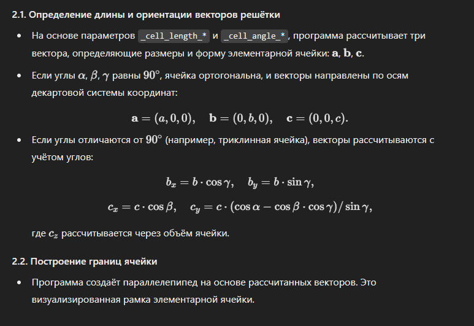
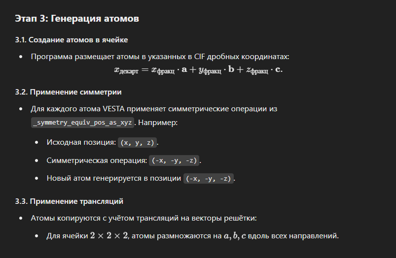
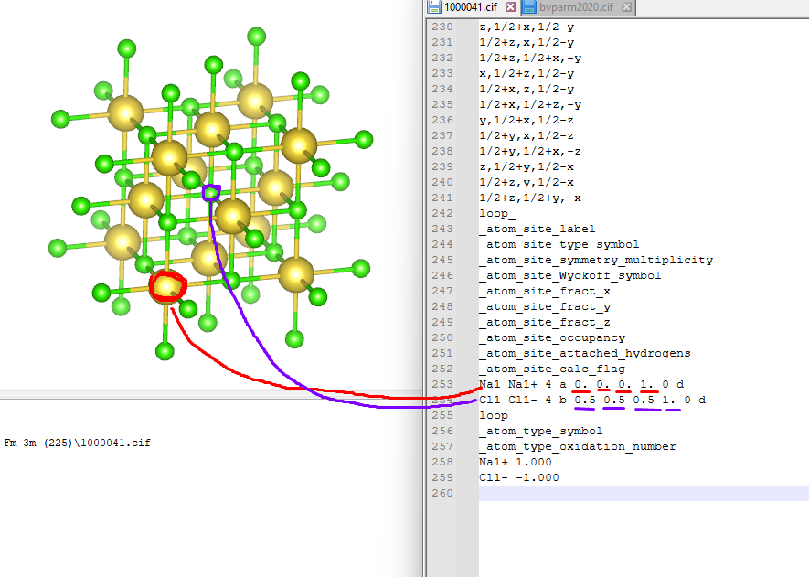
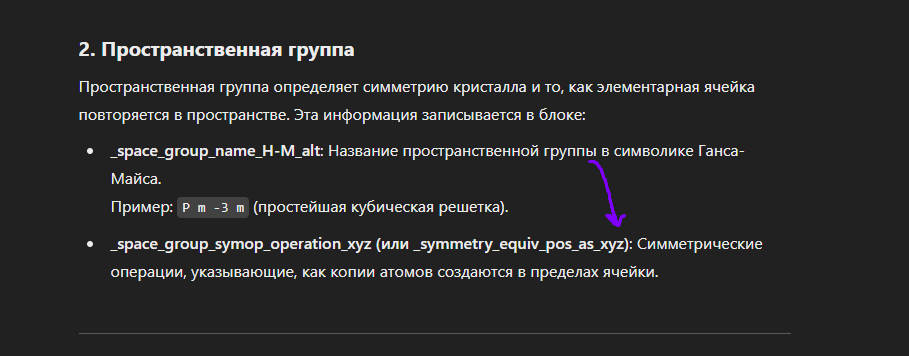

# CRIS — Crystal Recognition & Identification System

Это проект по распознаванию кристаллических решеток. ...

## Структура проекта

### Директории

* data - файлы для обработки и вывода (cif/csv/json/xyz/images).
* db - скрипты базы данных.
* src - файлы ресурсов для интерфейса.
* ui - описания пользовательских интерфейсов на qt.
* reports - отчеты с результатами поиска.
* info_examples - изображения к readme-файлам.

### Скрипты

База данных:

* db_init.py - инициализация базы данных.
* config.py - конфигурация подключения к базе данных.
* lattice_types_init.py - заполнение всех базовых типов кристаллических решеток. Заполняет таблицу lattice_type.
* json_to_db.py - добавляет информацию из json файла в базу данных. Заполняет таблицы substances и ions_library.
* xyz_to_db.py - добавляет информацию из xyz файла в базу данных. Заполняет таблицу ions.
* complete_db.py - запускает все необходимые скрипты для полной инициализации базы данных и добавления в нее информации.
* coordinates_nondimensionalization.py - Нормализация координат к виду 0.0-1.0.

Алгоритмы?
* ions_query.py - функция поиска схожих xyz в БД и функция поиска решеток на микроуровне по координатам.

Приложение:

* main.py - запуск приложения с интерфейсом.
* generate_report.py - генерация отчета с результатами поиска по координатам.

Интерфейс:

* Main_Window_ui.py - основное окно приложения.
* Ion_Dialog_ui.py - окно ввода координат.
* Info_Dialog_ui.py - окно с информацией.
* resources_rc.py - ресурсы для интерфейса.

## Требования

* python 3.10+
* requirements.txt
* MySQL 8.0+ Server (localhost:3306)

## Cheatsheet

* Запуск БД

1. MySQL 8.0 Command Line Client
2. config.py - password
3. `use crystal_lattice_db;`

* Пересоздать базу данных

1. Пересоздадим бд

```bash
drop database crystal_lattice_db;
create database crystal_lattice_db;
use crystal_lattice_db;
```

2. `complete_db.py`

* Посмотреть таблицы

```bash
use crystal_lattice_db;
show tables;
select * from lattice_type;
select * from substances;
select * from ions_library;
select * from ions;
```

* Установить язык

```python
cursor.execute("\\! chcp 1251")
```

* Ручной перевод cif -> json в ubuntu

```bash
cif_filter *.cif --json-output > *.json
```

* Ручной перевод всех cif файлов в директории в json в ubuntu

```bash
for file in *.cif; do cif_filter "$file" --json-output | jq '.' > "${file%.cif}.json"; done
```

3. ui to py

```bash
pyside6-uic ui/Info_Dialog.ui -o Info_Dialog_ui.py
pyside6-rcc src/resources.qrc -o resources_rc.py
```

## Задачи

### Текущие

- [ ] Полностью переработать БД в соответствии с новой концепцией
- [ ] Пересобрать структуру проекта, навести порядок в директориях и документациях
  - [ ] Первым делом определиться какую структуру мы хотим видеть, чтобы не переусложнить, но чтобы все было на своих местах.
  - Директория RESEARCH остается как есть, туда складывается все, что относится к теории, патентам, документам и т.п.
  - [ ] Переработать директорию data, чтобы не было миллион папок в одном корне, придумать решение проблемы. Разделить примеры и реальную базу данных.
  - [ ] Директория ML может остаться как есть или лучше перенести в scripts?
  - [ ] Придумать куда лучше переместить spectre_diff
  - [ ] Перенести информацию о VESTA из readme.md в отдельную документацию Project_Information.md
  - [ ] Улучшить вводное описание проекта в readme.md
  - [ ] Все, что связано с интерфейсом перенести в ui
- [ ] Сложная часть с закольцовыванием проекта. Переделать пайплайн распознавания так, чтобы результаты нейронки снова попадали в БД.
  - [ ] Отдельная таблица с кэшированными резами распознавания нейросети - т.е. вектор ML а не все KDE.
  - [ ] Если вещество уже было распознано, то берем вектор из БД, а не заново распознаем. Здесь подумать что будет являться ключем
- [ ] Реализовать еще один метод DL. Был один с RF, теперь нужно попробовать еще один метод ML или еще один AI. В итоге сравнить результаты.
  - [ ] Отдельную таблицу или просто поле для каждого метода DL
- [ ] Сейчас куча точек входа. С одной стороны нужно чтобы было удобно локально запускать и тестировать код, но сейчас все намешано.
- [ ] гитигнор data/csv_kde
- [ ] examples, BD, accurate/innacurate
- [ ] отдельный скрипт для обучения юпитеровский, а отдельный для распознавания по PKL-файлам

### Что? Вопросы

- [ ] В cif-файлах бывает неопределенность в float-значениях (к примеру: `0.123(20)`). Как решить эту проблему?
- [ ] Если результат выдает очень много вариантов решеток и элементов (более 10), то стоит выводить все или только часть?
- [ ] Какой элемент выделять предпочтительным, если вероятности для нескольких типов могут совпадать?
- [ ] Точность 6 знаков после запятой достаточно (возможно встречаются файлы в которых она больше)?
- [ ] Корректно ли ограничение в 1000 атомов? (бывает и несколько тысяч, но это исключения для химии)

### Баги

- [ ] Если не создана база данных, то при инициализации будет давать ошибку. Нужно перед подключением сделать отдельный мини запрос с созданием бд на сервере.
- [ ] Нужно подумать как переписать логику под библиотеки numpy и прочие, матешу не оч хорошо выполнять чистым питоном (i guess)
  - [ ] Перейти к явным типам данных, оптимизировать вычисления, оставить высокую точность
- [ ] Длииииннные координаты в названии графиков ограничить (низкий приоритет исправления)

### Возможные пути развития и будущие задачи

- [ ] Добавить поле в базу данных, связывающее элементы с индексами из COD (?).
- [ ] Если нужно будет то добавить dictionary.md со статьями и терминами (зачем?)
- [ ] Автоматическая сортировка файлов по категориям.
- [ ] 3D-визуализация решеток.
- [ ] Поддержка изображений в формате svg и их масштабирование.
- [ ] Переименовать некоторые поля в базе данных на более корректные (к примеру согласовать числа для существительных lattice_type -> lattice_types)
- [ ] Переименовать все элементы пользовательского интерфейса на более понятные.
- [ ] Валидация того, что новая строка в базе данных ранее отсутствует (без учета поля id). Валидация единичности экземпляров.
- [ ] Ионы в ions_library не указан что за тип иона из таблицы ions, ex Na или Cl? неизвестно (?)
- [ ] Расшифровка есть, а аббревиатура вещеста нет в субстансес табличке
- [ ] Новое ui
- [ ] Более современный вид документации нежели md-файлы? Автодокументация?
- [ ] РАГ-система легирования похожих веществ
- [ ] Поисковой движок (что-то типо ElasticSearch только по статьям/исследованиям)?
- [ ] Организовать проект как САМОСТОЯТЕЛЬНЫЙ модуль/библиотеку для Python

## Информация о VESTA:

#### 1) Поиск параметров элементарной ячейки

Программа считывает информацию для определения формы и размеров решетки
- Длины сторон (_cell_length_a, _cell_length_b, _cell_length_c)
- Углы между сторонами (_cell_angle_alpha, _cell_angle_beta, _cell_angle_gamma)



#### 2) Чтение пространственной группы

Программа считывает данные о пространственной группе. 
- Если есть строка _symmetry_space_group_name_H-M, то в виде например Fm-3m.
- Если нет предыдущей, то считывает строку с _space_group_IT_number, она содержит число (например в ней содержится число 255, это = Fm-3m)

#### 3) Считывание координат атомов

Программа считывает координаты атомов (или как пицца называет их ионами), они записываются как _atom_site_label (название атома), _atom_site_fract_x (координата x), _atom_site_fract_y (координата y), _atom_site_fract_z (координата z).

#### 4) Если задан параметр _atom_site_occupancy, он учитывается при визуализации, чтобы отобразить частичное заполнение узлов.

#### 5) Чтение симметрических операций

Симметрические операции (_symmetry_equiv_pos_as_xyz) определяют, как повторяются атомы в ячейке.



По вот этим данным мы строим вот эти 2 самых основных иона в решетке, это называется атомным узлом и этот узел, как поняла, будет дублироваться по всей решетке.


Вот тут по факту пространственная группа описывает только расположение атомов в веществе, а значит у пространственной группы будут одинаковые уравнения эквивалентности (которых дофига)


И он делает с каждым элементом вот эти вот преобразования, и по факту получаем решеточку

## Как можно организовать структуру

Это пример:

```
lattice_definition/
│
├── README.md
├── requirements.txt
├── setup.py                    # Для установки как пакет
├── .gitignore
│
├── config/                     # Конфигурация приложения
│   ├── __init__.py
│   ├── settings.py            # Основные настройки (пути, параметры БД)
│   └── constants.py           # Константы (типы решеток, пороги)
│
├── data/                      # Данные проекта (не в git)
│   ├── raw/                   # Исходные данные
│   │   ├── cif/              # Crystallographic Information Files
│   │   ├── xyz/              # Координаты атомов
│   │   └── json/             # Дополнительные данные о веществах
│   │
│   ├── processed/            # Обработанные данные
│   │   ├── csv/              # Экспортированные координаты
│   │   ├── csv_kde/          # KDE массивы для анализа
│   │   └── spectrum/         # Спектры для сравнения
│   │
│   ├── database/             # База данных
│   │   └── lattice.db        # SQLite БД
│   │
│   └── examples/             # Примеры для пользователей
│       └── csv/
│
├── reports/                   # Сгенерированные отчеты (не в git)
│   └── .gitkeep
│
├── resources/                 # Статические ресурсы
│   ├── images/               # Изображения решеток
│   │   ├── cubic.png
│   │   ├── hexagonal.png
│   │   └── ...
│   │
│   ├── icons/                # Иконки приложения
│   │   ├── logo.svg
│   │   ├── refresh.svg
│   │   └── ...
│   │
│   └── ui/                   # Qt UI файлы
│       ├── main_window.ui
│       ├── ion_dialog.ui
│       ├── info_dialog.ui
│       ├── resources.qrc
│       └── ui_palette.xml
│
├── src/                      # Исходный код приложения
│   ├── __init__.py
│   │
│   ├── main.py              # Точка входа в приложение
│   │
│   ├── ui/                  # Презентационный слой (GUI)
│   │   ├── __init__.py
│   │   ├── main_window.py           # Главное окно
│   │   ├── dialogs/
│   │   │   ├── __init__.py
│   │   │   ├── ion_dialog.py       # Диалог ввода координат
│   │   │   └── info_dialog.py      # Диалог справки
│   │   │
│   │   ├── generated/              # Сгенерированные из .ui файлов
│   │   │   ├── __init__.py
│   │   │   ├── main_window_ui.py
│   │   │   ├── ion_dialog_ui.py
│   │   │   ├── info_dialog_ui.py
│   │   │   └── resources_rc.py
│   │   │
│   │   └── widgets/                # Кастомные виджеты
│   │       └── __init__.py
│   │
│   ├── core/                       # Бизнес-логика
│   │   ├── __init__.py
│   │   │
│   │   ├── analysis/              # Анализ структур
│   │   │   ├── __init__.py
│   │   │   ├── lattice_analyzer.py      # Определение типа решетки
│   │   │   ├── spectrum_analyzer.py     # Анализ спектров
│   │   │   ├── clustering.py            # UMAP/HDBSCAN кластеризация
│   │   │   └── similarity.py            # Метрики схожести
│   │   │
│   │   ├── preprocessing/         # Предобработка данных
│   │   │   ├── __init__.py
│   │   │   ├── coordinates.py           # Нормализация координат
│   │   │   ├── vector_operations.py     # Векторные операции
│   │   │   └── kde_calculator.py        # Расчет KDE
│   │   │
│   │   └── models/                # Модели данных
│   │       ├── __init__.py
│   │       ├── ion.py                   # Класс Ion
│   │       ├── lattice.py               # Класс Lattice
│   │       └── substance.py             # Класс Substance
│   │
│   ├── data/                      # Слой доступа к данным
│   │   ├── __init__.py
│   │   │
│   │   ├── database/              # Работа с БД
│   │   │   ├── __init__.py
│   │   │   ├── connection.py            # Подключение к БД
│   │   │   ├── models.py                # ORM модели (если используется)
│   │   │   ├── queries.py               # SQL запросы
│   │   │   ├── init_db.py               # Инициализация БД
│   │   │   └── schema.sql               # Схема БД
│   │   │
│   │   ├── parsers/               # Парсеры файлов
│   │   │   ├── __init__.py
│   │   │   ├── cif_parser.py            # Парсинг CIF
│   │   │   ├── xyz_parser.py            # Парсинг XYZ
│   │   │   ├── json_parser.py           # Парсинг JSON
│   │   │   └── csv_parser.py            # Парсинг CSV
│   │   │
│   │   └── loaders/               # Загрузчики данных
│   │       ├── __init__.py
│   │       ├── file_loader.py           # Загрузка из файлов
│   │       └── db_loader.py             # Загрузка из БД
│   │
│   ├── utils/                     # Вспомогательные утилиты
│   │   ├── __init__.py
│   │   ├── file_utils.py                # Работа с файлами
│   │   ├── math_utils.py                # Математические функции
│   │   ├── validation.py                # Валидация данных
│   │   └── logging_config.py            # Настройка логирования
│   │
│   └── exports/                   # Экспорт результатов
│       ├── __init__.py
│       ├── report_generator.py          # Генерация отчетов
│       └── templates/                   # Шаблоны отчетов
│           └── report_template.docx
│
├── tests/                         # Тесты
│   ├── __init__.py
│   ├── conftest.py               # Pytest fixtures
│   │
│   ├── unit/                     # Юнит-тесты
│   │   ├── test_coordinates.py
│   │   ├── test_clustering.py
│   │   └── test_parsers.py
│   │
│   ├── integration/              # Интеграционные тесты
│   │   ├── test_database.py
│   │   └── test_analysis_pipeline.py
│   │
│   └── test_data/                # Тестовые данные
│       ├── sample.cif
│       └── sample.xyz
│
├── scripts/                       # Утилиты и скрипты
│   ├── init_database.py          # Инициализация БД
│   ├── import_data.py            # Импорт данных из CIF/XYZ
│   ├── generate_kde.py           # Генерация KDE массивов
│   ├── generate_spectra.py       # Генерация спектров
│   └── research/                 # Исследовательские ноутбуки
│       └── analysis.ipynb
│
└── docs/                         # Документация
    ├── architecture.md           # Архитектура приложения
    ├── database_schema.md        # Схема БД
    ├── user_guide.md             # Руководство пользователя
    └── api/                      # API документация
        └── index.md
```
